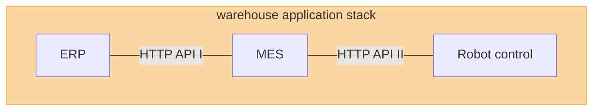

# shr-mfg-warehouse-erp

Overview of control applications for the warehouse model

```mermaid
    graph TD
    subgraph AA["&nbsp warehouse application stack &nbsp"]
        A[ERP]---|HTTP API I|B[MES]---|HTTP API II|C[Robot control]
    end

    style AA fill:#FAD7A0, stroke:#F5B041
```

* ERP this repo
* MES repo
* Robot control

* HTTP API I
* HTTP API II
