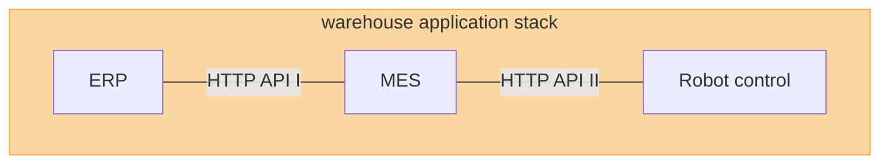

# shr-mfg-warehouse-erp

Overview of control applications for the warehouse model

* ERP this repo
* [MES repo](https://github.com/fsprojekti/shr-mfg-robotic-arm-warehouse)
* [Robot control](https://github.com/fsprojekti/shr-mfg-robotic-arm-http-server)

## HTTP API documentation

### Warehouse ERP API

| Method | Path                                          | Description                        | Parameters | Response                                         |
|--------|-----------------------------------------------|------------------------------------|------------|--------------------------------------------------|
| GET    | `/account/get/`                               | get account data                   |            | { String address String privateKey } |
| GET    | `/account/balance/eth/get`                    | get account balance of ETH         |            | { String balance }                       |
| GET    | `/account/balance/token/get`                  | get account balance of Tokens      |            | { String balance }                       |
| GET    | `/capacity/pool/get`                          | get capacity pool                  |            | { String capacity }                      |
| GET    | `/capacity/pool/offer/get`                    | get offers from the pool           |            | { Array<Offer> offers }                  |
| GET    | `/capacity/registry/get`                      | get capacity registry              |            | { Object capacityRegistry }              |
| GET    | `/capacity/registry/providers/get`            | get list of capacity providers     |            | { Array<Providers> providers }           |
| GET    | `/capacity/registry/consumers/get`            | get list of capacity consumers     |            | { Array<Consumers> consumers }           |
| GET    | `/capacity/registry/provider/register/new`    | register new capacity provider url | String url | { String Address String url }        |
| GET    | `/capacity/registry/provider/register/update` | update capacity provider url       | String url | { String Address String url }        |

### Warehouse MES API

### Robot control API
